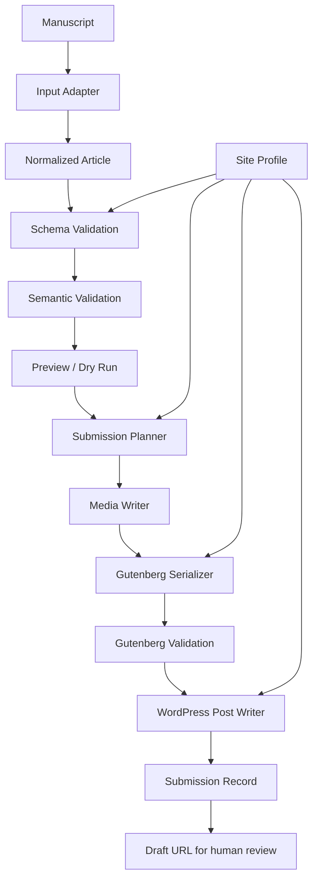

# PressDrop Design

Status: **Initial design / pre-MVP**  
Last updated: 2026-08-27

This document describes the initial architecture and product boundaries for PressDrop. It is intentionally written before implementation so that the first vertical slice tests a coherent mechanism rather than accumulating unrelated import features.

The research basis for this design is [`docs/research/wordpress-submission-assistant-research.md`](research/wordpress-submission-assistant-research.md).

---

## 1. Problem statement

PressDrop converts a structured manuscript into a reviewable WordPress draft.

The core problem is not merely "send HTML to WordPress." WordPress already exposes APIs for posts, media, taxonomies, and metadata. The hard and reusable part is the layer that interprets a manuscript's explicit structure and maps it safely to the target site's publishing model.

A useful PressDrop run should answer four questions deterministically:

1. **What does this manuscript contain?**
2. **Is the manuscript valid enough to submit?**
3. **How should those elements map to this WordPress site?**
4. **Can the same operation be retried without producing accidental duplicates?**

## 2. Research-derived constraints

The initial research supports several technical conclusions that this design treats as constraints:

- WordPress REST API can create drafts and upload media.
- Gutenberg content can be submitted through the REST API as serialized block HTML.
- Gutenberg output should be validated rather than assembled as arbitrary HTML wrapped in block comments.
- Mammoth is a practical basis for semantic DOCX conversion when Word styles carry meaning.
- remark/rehype are practical bases for structured Markdown/HTML processing.
- Markdown, HTML, and DOCX should all be treated as untrusted input at the conversion boundary.
- Automatic publishing should not be part of the first version; the safe default is `draft`.
- Application Passwords over HTTPS are a practical WordPress authentication mechanism for external tools.
- Re-running a submission requires explicit duplicate/idempotency handling.

The research also recommends narrowing an MVP to Markdown and DOCX, standard Gutenberg blocks, and standard posts before adding native Google Docs or site-specific block systems.

## 3. Product goals

### Primary goals

PressDrop should:

- turn a supported structured manuscript into a WordPress draft with minimal manual repair;
- preserve semantic structure rather than visual layout;
- handle text, headings, images, captions, credits, categories, tags, and basic metadata;
- make conversion errors visible before submission;
- keep source-format parsing separate from WordPress-specific mapping;
- support multiple WordPress sites through configuration rather than forks;
- be safe to retry;
- leave final publication to a human.

### Secondary goals

The architecture should make it straightforward to add:

- native Google Docs input;
- additional manuscript templates;
- custom post types;
- custom fields and SEO metadata;
- site-specific Gutenberg block adapters;
- batch workflows;
- a richer GUI.

## 4. Non-goals

PressDrop is not intended to become:

- a replacement CMS;
- a rich text editor;
- a collaborative writing platform;
- an AI article generator;
- a general Word-to-HTML fidelity converter;
- a browser macro that clicks through wp-admin;
- an automatic publishing bot;
- a universal importer for every WordPress plugin and custom block from day one.

These boundaries matter. The value of PressDrop is the controlled transformation layer, not the number of unrelated publishing features around it.

## 5. Architectural principles

### 5.1 Deterministic before intelligent

A manuscript element should be recognized because the manuscript declares it through a known rule: front matter, a Word style, a label, or another explicit convention.

The first version should not ask a language model to infer whether a paragraph "looks like" a caption or whether some text "probably" belongs in a custom field. AI-assisted fallback may later be useful as an opt-in aid, but it must not become the only way to understand a manuscript.

### 5.2 Normalize once

All input adapters produce the same normalized article model. Downstream validation and WordPress output operate on that model, not on DOCX, Markdown, or Google Docs directly.

### 5.3 Validate before side effects

Parsing and validation should complete before creating a post or uploading media wherever possible.

The desired order is:

```text
parse → normalize → validate → preview → perform WordPress side effects
```

### 5.4 Draft-only by default

The initial WordPress writer only creates `draft` posts. Even if the authenticated account can publish, PressDrop should not expose automatic publication in the MVP.

### 5.5 Configuration over site-specific branches

Publication-specific mappings belong in a site profile. A new WordPress target should normally require a new profile, not source-code edits.

### 5.6 Retry safely

A network failure after a media upload or post creation is normal distributed-system behavior. PressDrop must assume partial success and make retry behavior explicit.

## 6. High-level architecture



The key boundaries are:

- **Input Adapter**: source format → normalized article
- **Site Profile**: normalized article concepts → target-site concepts
- **WordPress Adapter**: validated plan → remote side effects

## 7. Pipeline stages

### Stage 1: Acquire input

Inputs may originate from:

- local Markdown files;
- local DOCX files;
- later: Google Docs / Google Drive;
- later: trusted HTML or another adapter.

The acquisition layer should provide the parser with bytes/text plus basic source metadata such as filename, source ID, modification time, and optional external document ID.

### Stage 2: Parse source format

Each adapter understands only its source format and explicit manuscript conventions.

Examples:

- Markdown: front matter + Markdown AST
- DOCX: Word styles → semantic HTML/markers via Mammoth

An adapter may emit warnings, but it must not write to WordPress.

### Stage 3: Normalize

The source structure is transformed into a stable PressDrop article representation.

Normalization removes format-specific details that downstream components should not care about. A heading is a heading whether it came from `##` in Markdown or a Word Heading 2 style.

### Stage 4: Validate

Validation has two levels.

**Schema validation** checks shape and types:

- required fields exist;
- heading levels are legal;
- media items have valid references;
- taxonomy and metadata values use supported types.

**Semantic validation** checks publishing rules:

- title is non-empty;
- required site-profile fields are present;
- image files exist and are within limits;
- unsupported blocks are rejected or downgraded explicitly;
- taxonomy mappings resolve;
- no known unsafe HTML remains;
- there is enough identity information to make retry behavior safe.

Validation produces errors and warnings. Errors block submission. Warnings are shown to the user and can be acknowledged.

### Stage 5: Preview / dry run

Before remote side effects, PressDrop should be able to show:

- parsed title/excerpt;
- ordered block list;
- images, alt text, captions, and credits;
- categories/tags;
- custom metadata;
- target site/profile;
- conversion warnings;
- a generated Gutenberg preview or inspectable serialized output.

A dry run should exercise all local transformation stages without requiring WordPress credentials.

### Stage 6: Build a submission plan

The planner resolves the normalized article plus site profile into an explicit plan, for example:

```text
1. Resolve category "News" → term ID 12
2. Upload media image-01.jpg unless known hash already exists
3. Generate core/image using returned media ID and URL
4. Serialize remaining core blocks
5. Create post as draft
6. Record source fingerprint ↔ WordPress post ID
```

Making this plan inspectable simplifies debugging and testing.

### Stage 7: Execute WordPress side effects

Side effects should be performed in a controlled order:

1. resolve/create allowed taxonomy terms according to profile policy;
2. resolve/reuse or upload media;
3. generate final Gutenberg content using remote media IDs/URLs;
4. validate generated block serialization;
5. create or update the intended draft;
6. persist the submission result.

The MVP should prefer **create draft**. Update behavior should be added only after identity semantics are well defined.

## 8. Normalized article model

The normalized model is the most important internal API in PressDrop.

A conceptual TypeScript shape might look like this:

```ts
interface Article {
  schemaVersion: 1;
  source: SourceIdentity;
  title: string;
  excerpt?: string;
  blocks: Block[];
  taxonomies?: {
    categories?: string[];
    tags?: string[];
    [taxonomy: string]: string[] | undefined;
  };
  meta?: Record<string, JsonValue>;
  featuredMediaRef?: string;
  sourceNotes?: string[];
}

interface SourceIdentity {
  adapter: "markdown" | "docx" | string;
  sourceId?: string;
  filename?: string;
  fingerprint: string;
}

type Block =
  | ParagraphBlock
  | HeadingBlock
  | ImageBlock
  | QuoteBlock
  | ListBlock
  | NoteBlock
  | RawHtmlBlock;
```

The exact implementation will evolve, but several rules should remain stable.

### 8.1 Blocks are semantic

The normalized model should express `heading`, `image`, and `note`, not Word run properties or Markdown token details.

### 8.2 Media uses stable local references

An image block should reference a media object by stable ID/ref before WordPress upload. Remote WordPress IDs and URLs belong to the submission result, not the source model.

Conceptually:

```json
{
  "type": "image",
  "mediaRef": "hero-photo",
  "alt": "A descriptive alt text",
  "caption": "Photo caption",
  "credit": "Photo: Example"
}
```

A separate media table can contain the local path/bytes, MIME type, hash, dimensions, and source relationship.

### 8.3 Credits are not silently collapsed into captions

Some WordPress sites display credits inside a caption; others store them separately. PressDrop should preserve `caption` and `credit` as distinct semantic values until a site profile intentionally maps them.

### 8.4 Metadata remains controlled

`meta` is not permission to send arbitrary keys to WordPress. A site profile must explicitly allow and map metadata fields that can cross the WordPress boundary.

### 8.5 Version the model

The normalized format should include a schema version from the beginning. Adapters and fixtures can then be migrated deliberately if the internal contract changes.

## 9. Input adapters

### 9.1 Markdown adapter

Proposed MVP conventions:

- YAML front matter for document-level metadata;
- ordinary Markdown for body structure;
- relative image paths for local media;
- an explicit extension/directive syntax only where standard Markdown lacks a required semantic concept such as image credits or editorial notes.

Example:

```md
---
title: Example article
excerpt: Short lead
categories:
  - News
tags:
  - Example
---

## Heading

Body paragraph.


```

Credit syntax should be decided only after testing real manuscripts; it should not be invented prematurely.

### 9.2 DOCX adapter

The DOCX adapter should use **semantic Word styles**, not formatting heuristics.

A future PressDrop DOCX template might define styles such as:

- Title
- Lead
- Heading 2 / Heading 3
- Body
- Caption
- Credit
- Editorial Note

Mammoth style maps can convert those styles into semantic markers. The downstream HTML/AST stage can then normalize them.

The adapter should surface Mammoth conversion warnings. Complex layout fidelity is explicitly not a goal.

### 9.3 Native Google Docs adapter

Deferred from the MVP.

The architecture should allow a later adapter to use Google Docs/Drive APIs and produce the same normalized model. Until then, DOCX export is an acceptable bridge for proving the core pipeline.

## 10. Site profiles

A site profile describes what a specific WordPress site expects.

It should be configuration, not executable arbitrary code, for common cases.

Conceptual example:

```yaml
id: example-site
wordpress:
  baseUrl: https://example.com
  postType: posts
submission:
  status: draft
  allowCreateTerms: false
mapping:
  excerpt: excerpt
  credit:
    mode: append-to-caption
meta:
  allowed:
    - source_url
blocks:
  allowed:
    - core/paragraph
    - core/heading
    - core/image
    - core/list
    - core/quote
```

Credentials should not be committed into the profile.

Site profiles may later define:

- custom post type;
- category/tag taxonomy aliases;
- whether missing terms can be created;
- custom-field mappings;
- SEO-plugin mappings;
- custom block adapters;
- caption/credit rendering policy;
- featured image rules;
- required fields;
- maximum file sizes or allowed MIME types.

## 11. WordPress adapter

### 11.1 Authentication

The initial design assumes HTTPS plus WordPress Application Passwords, using a dedicated account with minimum necessary permissions where practical.

Credential storage depends on the eventual delivery model and is therefore not fixed yet. However:

- credentials must never live in repository configuration;
- logs must not print them;
- a local CLI should prefer OS/environment secret mechanisms;
- a hosted service would require a separate, explicit credential-encryption and data-retention design review.

### 11.2 Media

Media upload occurs before final Gutenberg serialization because standard image blocks may need the remote media ID and URL.

PressDrop should record at least:

- local/source media fingerprint;
- WordPress media ID;
- final URL;
- upload status;
- optional source filename.

A retry can then reuse an upload produced by the same submission instead of duplicating it.

### 11.3 Taxonomies

The normalized article can use human-readable taxonomy values. The site adapter resolves them to WordPress term IDs.

Term creation must be profile-controlled. A typo should not silently create a new public category.

### 11.4 Metadata

Only metadata explicitly allowed by a profile should be submitted. WordPress plugins may also need to expose/register fields for REST use; PressDrop should report unsupported mappings rather than silently dropping them.

### 11.5 Posts

MVP behavior:

- create standard post;
- always send `status: draft`;
- send title, excerpt where configured, content, taxonomy IDs, featured media, and allowed metadata;
- return and record the resulting post ID and edit/view URL where available.

## 12. Gutenberg generation

PressDrop should not treat Gutenberg as arbitrary HTML with decorative comments.

The intended process is:

1. normalized semantic block;
2. mapped supported Gutenberg block;
3. serialized block HTML;
4. parsed/validated with WordPress block tooling;
5. submitted as post content.

The MVP block set should remain intentionally small:

- `core/paragraph`
- `core/heading`
- `core/image`
- `core/list`
- `core/quote`

Additional blocks should be added with fixtures and serialization tests.

For site-specific blocks, the long-term extension point should be an output adapter/mapper rather than contaminating the normalized source model with site-specific block names.

## 13. Idempotency and submission state

Retry safety is a first-class requirement.

### 13.1 Identity

A submission should have a stable identity derived from some combination of:

- explicit external manuscript/document ID when available;
- normalized source fingerprint;
- source filename/location as diagnostic metadata;
- target site profile.

A pure byte hash is not sufficient for every future workflow because harmless source-file changes can change bytes. The MVP can begin with a documented fingerprint strategy and evolve after observing real editing/retry behavior.

### 13.2 Submission record

Conceptual record:

```json
{
  "submissionId": "...",
  "sourceFingerprint": "...",
  "siteProfile": "example-site",
  "wordpressPostId": 123,
  "status": "draft-created",
  "media": {
    "hero-photo": {
      "fingerprint": "...",
      "wordpressMediaId": 456
    }
  }
}
```

The first implementation can persist this locally. The storage engine should sit behind a small interface so a future GUI/service can replace it without changing parsers.

### 13.3 Retry policy

The MVP should distinguish:

- **new submission**: no known successful result;
- **resume**: prior attempt partially completed;
- **duplicate candidate**: same source appears already submitted;
- **update**: intentional modification of an existing draft — deferred until explicitly designed.

PressDrop must not silently choose "update existing post" when identity is ambiguous.

## 14. Security model

PressDrop touches unpublished manuscripts and CMS credentials, so a small security model belongs in the initial design.

### Input boundary

Treat all manuscript content as untrusted:

- limit file size;
- limit parser resource consumption/time where practical;
- sanitize HTML;
- restrict allowed URI schemes;
- never execute embedded content/macros/scripts;
- validate image MIME/type rather than trusting the extension;
- keep external resource fetching disabled by default unless explicitly designed.

### WordPress boundary

- HTTPS required for credentialed REST operations;
- minimum-permission WordPress account;
- Application Password can be revoked independently;
- credentials never committed to the repository;
- no credential values in logs/errors;
- `draft` only in MVP.

### Metadata boundary

Site profiles operate as an allowlist for fields sent to WordPress. Unknown source metadata must not automatically cross into remote custom fields.

## 15. Error and warning model

Errors should be structured rather than only human-readable strings.

Useful categories include:

- `INPUT_READ_ERROR`
- `UNSUPPORTED_INPUT`
- `PARSE_ERROR`
- `CONVERSION_WARNING`
- `VALIDATION_ERROR`
- `MISSING_MEDIA`
- `UNSUPPORTED_BLOCK`
- `SITE_PROFILE_ERROR`
- `AUTH_ERROR`
- `TAXONOMY_RESOLUTION_ERROR`
- `MEDIA_UPLOAD_ERROR`
- `GUTENBERG_VALIDATION_ERROR`
- `POST_CREATE_ERROR`
- `DUPLICATE_CANDIDATE`

Every remote-side-effect error should include enough context to determine whether retrying is safe, without leaking secrets.

## 16. User-facing shape

The final product shell is intentionally undecided.

A useful separation is:

```text
pressdrop-core
  ├─ parsers/adapters
  ├─ normalized model
  ├─ validation
  ├─ site profiles
  ├─ WordPress client
  └─ submission state

interfaces
  ├─ CLI (good first engineering harness)
  ├─ local web/desktop UI (possible end-user shell)
  └─ hosted service (future, different security/operations model)
```

A CLI is a strong candidate for the first vertical slice because it exposes the core pipeline with little UI infrastructure. That is an implementation strategy, **not** a decision that the final editor-facing product must be command-line driven.

The user experience PressDrop ultimately wants is much simpler:

```text
Choose manuscript
→ choose WordPress destination
→ inspect warnings / preview
→ Create draft
→ Open WordPress draft
```

## 17. Testing strategy

The architecture should be fixture-driven from the first implementation.

### Parser fixtures

For each source adapter:

- minimal valid manuscript;
- Japanese text and punctuation;
- headings and lists;
- multiple images;
- caption + credit;
- missing required fields;
- malformed metadata;
- unsupported/complex source content.

Expected output should be the normalized article model.

### Gutenberg snapshot/round-trip tests

For every supported block:

1. generate serialized Gutenberg content;
2. parse it with official WordPress block parser tooling;
3. assert block names, attributes, ordering, and relevant inner content.

This is important because visually plausible HTML can still become an invalid Gutenberg block.

### WordPress integration tests

A disposable WordPress environment should eventually test:

- Application Password authentication;
- draft creation;
- media upload;
- alt/caption handling;
- taxonomy resolution;
- Japanese titles/tags/categories;
- retry after partial failure;
- generated draft remains editable in Gutenberg without block recovery warnings.

No production site should be the primary automated test target.

## 18. Proposed implementation direction

This section is a proposal, not yet a locked decision.

### Runtime

**TypeScript / Node.js** is currently the strongest candidate because the likely building blocks already fit the ecosystem:

- mammoth;
- unified / remark / rehype;
- JSON Schema validators;
- WordPress block parser/serialization packages;
- straightforward REST clients;
- reuse between CLI and future web UI.

### Suggested package boundaries

A future repository might grow toward:

```text
src/
  core/
    model/
    validation/
    submission/
  adapters/
    markdown/
    docx/
  wordpress/
    client/
    gutenberg/
    site-profile/
  state/
  cli/
```

This is illustrative. Package boundaries should be introduced only when implementation pressure justifies them.

## 19. MVP vertical slice

The first implementation should prove one complete route rather than many half-routes.

Recommended slice:

```text
Markdown manuscript
→ normalized Article
→ validation
→ dry-run output
→ WordPress media upload
→ core Gutenberg serialization
→ draft creation
→ submission record
```

Then add DOCX as the second source adapter against the same normalized contract.

A convincing MVP is not "we can POST text to WordPress." It is:

> A real structured manuscript, including at least one image/caption and taxonomy metadata, becomes a correct editable Gutenberg draft; a retry does not create accidental duplicates; errors are understandable.

## 20. Decisions intentionally deferred

The following should not be guessed into the first codebase:

1. final UI shell: CLI vs local web/desktop vs hosted;
2. license;
3. exact persisted-state database/file format;
4. exact Markdown syntax for credits/editorial notes;
5. exact DOCX template/style vocabulary;
6. automatic category/tag creation policy defaults;
7. draft-update semantics;
8. custom Gutenberg block plugin API;
9. native Google Docs timing;
10. hosted credential storage and manuscript retention policy.

They should be resolved using real manuscript fixtures and a working WordPress vertical slice.

## 21. Definition of architectural success

The initial architecture is successful if we can add a second input adapter or a second WordPress site without rewriting the core submission pipeline.

Concretely:

- Markdown and DOCX can produce the same normalized article fixtures;
- WordPress code does not import source-format-specific types;
- parsers can be tested without WordPress credentials;
- Gutenberg output can be tested without a live production site;
- a site profile can alter taxonomy/meta/caption behavior without modifying a parser;
- a failed submission can be resumed or safely rejected as ambiguous;
- the default outcome is always a human-reviewable draft.

That is the mechanism PressDrop should prove before expanding its feature surface.
