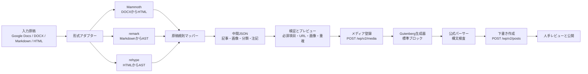

# 定型原稿からWordPress下書きを作る「汎用入稿アシスタント」調査レポート

**調査日:** 2026-08-27
**対象:** ライター・編集者・コンテンツチームが作成した定型原稿を、WordPressの下書きへ効率的かつ再現性高く投入するワークフロー。特定の媒体名・個別運用には依存しない。

## 1. 結論

**既存ツールだけで目的の一部は実現できるが、入力形式が混在し、画像キャプション・クレジット・カテゴリ・タグ・任意メタ情報・Gutenbergブロックまで定型ルールどおりに再現する用途では、少なくとも小さな補完実装が必要である。** Google Docsを正本に統一できる場合はGoPublishまたはWordable、DOCX／Google Docsを主に扱う場合はBlogSyncが、最初に試すべき既製候補となる。[1] [3] [5]

最も現実的な中長期案は、**既存の変換ライブラリとWordPress公式APIを組み合わせ、原稿規則の解釈・検証・サイト別マッピングだけを自作する**ことである。DOCXはMammoth、Markdownはremark、HTMLはrehypeで構造化し、画像は`/wp/v2/media`、下書き投稿は`/wp/v2/posts`へ投入する。Gutenbergは標準ブロックのシリアライズ済みHTMLを生成し、公式パーサーで検査できる。[9] [10] [11] [12] [13]

> **総合判断:** 「汎用WordPress入稿アシスタント」を新規に作る価値は**条件付きである**。Google Docsだけで完結し、分類・キャプション・独自メタの要件が軽いなら既製SaaSで十分な可能性が高い。一方、複数入力形式と独自の定型原稿規則を扱い、複数サイトへ安全に横展開したいなら、既製ツールの隙間を埋める軽量な変換・検証レイヤーには明確な意義がある。

| 判断軸 | 結論 |
|---|---|
| 既存ツールで足りるか | **条件付きで足りる。** Google Docs／DOCXに入力を統一し、標準的な投稿本文・画像・SEO項目を中心にするなら候補がある。 |
| 自作する価値 | **条件付きである。** 独自の原稿規則、画像キャプション・クレジット、分類・任意メタ、複数サイト、Gutenbergの正確な再現が要件になるほど価値が上がる。 |
| 最初に取るべき方法 | 実原稿2〜3本でGoPublishまたはBlogSyncを短期検証し、必須項目が欠ければ最小自作MVPへ進む。 |
| 需要の示唆 | Google Docs→WordPress、DOCX→CMS、Markdown→Block Editorを対象とする複数の商用・OSS製品が現存しており、コピー＆ペーストと書式・画像整形の削減には継続的な需要があると考えられる。ただし、汎用アシスタントの購入意向や価格受容性は、対象ユーザーへの聞き取りで別途検証すべきである。[1] [3] [5] [15] |

## 2. 調査範囲と評価方法

今回の評価では、単に本文を投稿画面へ転記できるかではなく、**「原稿ファイルまたは文書を与える → 構造を認識する → 画像とメタ情報を処理する → WordPress下書きが完成する」**ところまでの到達可能性を確認した。評価対象の入力形式はGoogle Docs、DOCX、Markdown、プレーンテキスト、HTMLである。

| 評価観点 | 主な確認項目 |
|---|---|
| 構造認識 | タイトル、リード、本文、見出し、画像、画像キャプション、クレジット、注記、カテゴリ、タグ、任意メタ情報、独自規則のマッピング |
| 投入方式 | WordPress管理画面、Gutenbergブロック、REST API、WP-CLI、WordPressプラグイン、ブラウザ拡張 |
| 自動化範囲 | 原稿読込、構造解析、変換、画像アップロード、キャプション設定、分類・タグ設定、下書き作成、バッチ処理 |
| 実用性 | 現在の保守状況、料金／ライセンス、データ処理場所、認証情報、複数サイト、日本語、導入実績の目安 |

すべての候補で日本語の完全な処理品質を公式に保証する資料は確認できなかった。したがって、見出し・句読点・全角記号・画像キャプション・日本語カテゴリ／タグ・SEOプラグイン項目を含む実原稿でのパイロット検証を、導入の必須条件とする。

## 3. 既存ツール・サービス・OSSの比較

### 3.1 既製サービス、WordPressプラグイン、ブラウザ拡張

| ツール名 | 種別／入力形式 | WordPressへの投入方法 | Gutenberg対応 | 画像・キャプション | メタ情報・定型ルール | 自動化範囲 | 料金／ライセンス・保守 | 今回の適合度 |
|---|---|---|---|---|---|---|---|---|
| **GoPublish** | 商用SaaS＋Google Docsアドオン。Google Docs、Google Sheets経由の複数Docs。 | REST APIを使う連携。下書き、非公開、予約、公開へ送信し、投稿・固定ページ・カスタム投稿型に対応する。[1] [2] | Classic Editor依存の記載はない。ただし任意のブロックHTML／独自ブロックを指定する根拠はない。 | Docsの画像転送、画像圧縮、AI生成altを案内。キャプションは明記なし。 | 抜粋、スラッグ、SEOメタタイトル・説明・alt。Yoast、RankMath等との連携。カテゴリ・タグ・任意メタの明示はない。 | 1件送信、Sheets一括、双方向同期、チーム権限まで。 | 無料枠は月10件、上位有料機能あり。WPプラグインv1.0.6、4か月前更新、100+有効インストールと表示。[1] [2] | **高**。Google Docsを標準にできるなら、最初に検証すべき候補。 |
| **BlogSync** | 商用SaaS＋WP受信プラグイン。DOCX、Google Docs、DOCX→Markdown出力。 | SaaS側で変換し、WPプラグインへ送信して下書きを作成する。[3] [4] | HTML本文を送る。ネイティブブロック生成・編集時の再現性は要テスト。 | 画像をWebPへ最適化し、メディアライブラリへアップロード。AI alt生成。キャプションは明記なし。 | 画像名・altは扱う。カテゴリ、タグ、任意メタ、独自規則のマッピングは不明。 | 原稿選択／アップロード→変換→画像付き下書き。 | 試用3投稿・25画像。月29／49／99米ドルの各プラン。WPプラグインv1.1.1、7か月前更新、10+有効インストールと表示。[3] [4] | **中〜高**。DOCXを主に扱う場合に最も近い。新規性と定型項目の再現は要検証。 |
| **Wordable** | 商用SaaS。Google Docs。 | WordPressアカウントと接続し、エクスポートで下書きまたは公開へ投入する。[5] [6] | 書式の変換を担うが、ブロックの粒度・独自ブロック制御は不明。 | Docs内画像をアップロード、圧縮、alt追加。キャプションは明記なし。 | 画像alt、リンク、HTML整形を主に案内。分類・任意メタ・独自マッピングの明示はない。 | 文書単位の入稿。 | 商用SaaS。公式サイトで継続提供を確認。料金・現行プランの詳細は契約前確認が必要。 | **中**。Google Docsの標準記事を素早く下書き化する候補。 |
| **LuckyFish Draft Importer** | WordPressプラグイン。構造化JSON、区切り記法、ファイルアップロード、貼付テキスト。 | WP管理画面のプラグインとして、下書き作成または既存投稿／ページへのマッピング更新。 | 本文HTMLは扱えるが、ブロック生成の仕様は不明。 | 画像アップロード・キャプションの公式記載なし。 | タイトル、本文、抜粋、カテゴリ、タグ、SEOフィールド。JSONが入力のため、外部の構造化処理は可能。 | 1回に最大5件を下書き作成。既存コンテンツの更新にも対応。 | GPLのWordPressプラグイン。v0.8.4、1か月前更新、10未満の有効インストールと表示。[7] | **中**。画像を別管理し、JSON化済みのテキストを少数投入する用途。 |
| **Ultimate Markdown** | WordPressプラグイン。Markdownファイル、貼付Markdown、内部ドキュメント。 | 管理画面からBlock Editor／Classic Editorの投稿内容へ変換。Pro版はREST API自動化を案内。 | 両エディタをサポート。Front Matterを扱う。 | Pro版で画像の自動アップロードを案内。キャプションの根拠はない。 | Front Matterで投稿設定を指定。変更履歴にはBlock Editorでのカテゴリ・タグ更新がある。任意メタはPro仕様の確認が必要。 | ファイル取込、複数Markdownの内部ライブラリ取込・出力。 | フリーミアム。v1.26、3か月前更新、2,000+有効インストール、WP 7.0.4まで試験済みと表示。[8] | **中**。Markdownを標準原稿に寄せられる場合に有力。 |
| **HBmarkdown For Editors** | WordPressプラグイン。Markdownファイル。 | 編集画面にファイルを投入し、投稿内容へ変換。 | Block Editor時に`wp:paragraph`、`wp:heading`、`wp:table`等のネイティブブロックを出力すると明記。 | Markdown画像記法を対象とするが、メディア自動登録・キャプションは明記なし。 | Front Matterの`title`でタイトルを設定。分類・タグ・任意メタは明記なし。 | 1投稿ごとの取込。外部送信なし、メモリ内で処理。 | OSSのWPプラグイン。v3.1.1、3か月前更新、40+有効インストールと表示。[15] | **低〜中**。Gutenberg変換の軽量な検証候補。バッチ・画像・メタには不足。 |
| **AI Article Publisher** | Chrome拡張。AIツールまたはWebページで選択したテキスト。 | ログイン済みのWordPress編集画面を開き、タイトル・本文を挿入する。 | SEO向けHTML整形を案内するが、ブロック・画像の仕様は不明。 | 画像・キャプションの記載なし。 | 自動タイトル検出、重複検知。分類・タグ・任意メタは対象外。 | 保存、検索、編集画面への挿入まで。公開は人手レビューを前提。 | Chrome拡張v1.4、2026-05-07更新。データはブラウザローカル保存と表示。[14] | **低**。テキストを1件ずつ転記する補助。定型原稿の自動入稿には不十分。 |
| **WordPress.com for Google Docs** | Automattic公式Google Docsアドオン。Google Docs。 | WordPress.comまたはJetpack経由で投稿。セルフホスト版はJetpackとJSON-API等が必要。 | 詳細なブロック制御は確認できない。 | 書式と画像を保ったアップロードを案内。キャプションの記載なし。 | 分類・タグ・任意メタ・独自マッピングの説明なし。 | Google Docsからの下書き保存・公開を支援。複数サイトを追加可能。 | Marketplaceで提供継続。料金は明示なし。Jetpackへの依存がある。[16] | **低〜中**。Jetpack許容のGoogle Docs単純入稿向け。 |
| **n8n** | ワークフロー自動化。Google Docs、Drive、HTTP、WordPress等を連携。 | WordPressノードまたはHTTP RequestでREST APIを呼び出す。 | ブロック生成は自作コード／別サービスが必要。 | 標準WordPressノードの機能説明は投稿・ページ・ユーザー中心。メディア等はHTTP APIで補完できる。 | 変数マッピング・カスタムコードで対応可能。ただし文書構造の精密な解析器ではない。 | トリガー、承認、通知、リトライ、スケジュール、投稿作成のオーケストレーション。 | クラウドまたはセルフホスト。ライセンス・運用方式は導入形態に依存。[17] | **補完用途**。提出・承認・通知の自動化に向く。 |
| **Zapier** | クラウド型ワークフロー自動化。Google Docs、WordPress。 | Google Docsフォルダへの新規文書をトリガーにWordPress投稿を作成するテンプレートを提供。 | ブロックの厳密な変換は対象外。 | 画像・キャプションの精密な変換は確認できない。 | 単純なフィールド連携向き。複雑なメタは追加APIステップが必要。 | 文書追加→投稿作成を低コードで構成。 | フリープランと有料機能。外部クラウドへデータを通す。[18] | **補完用途**。迅速なPoC向け。精密な原稿変換の中核には不足。 |

### 3.2 自作構成を支えるOSS・公式機能

| 要素 | 入力／役割 | WordPress・Gutenbergとの関係 | 画像・メタ情報 | 保守・ライセンス | 今回の位置づけ |
|---|---|---|---|---|---|
| **Mammoth / mammoth.js** | DOCXをセマンティックなHTMLへ変換。見出し、リスト、表、画像、リンク等に対応。独自Wordスタイルをstyle mapでHTMLへ対応付け可能。[9] | WordPressへの投入機能は持たない。後段でHTMLを中間JSONまたはブロックへ変換する。 | 画像バイナリをハンドラで取得でき、DOCXのaltがあればimg属性に反映。キャプション・メディア登録は別実装。 | BSD-2-Clause。npmのmammoth 1.12.1が17日前公開と表示。[9] | **DOCXアダプターの第一候補。** 原稿テンプレートのスタイル規約と組み合わせやすい。 |
| **remark / rehype** | Markdownをmdast、HTMLをhastというASTとして解析・変換。Front Matter、GFM等はプラグインで拡張できる。[10] | 中間JSON・HTMLを標準ブロックへ変換する前段。Gutenbergの生成自体は自作する。 | 画像・リンク・見出し等のノードを抽出可能。メタはFront Matter等の明示規約を設ける。 | MIT。成熟したunifiedエコシステム。[10] | **Markdown／HTMLアダプターの第一候補。** 独自定型ルールをAST上で実装できる。 |
| **WordPress REST API** | 投稿、メディア、カテゴリ、タグ等の標準データ操作。 | `POST /wp/v2/posts`に`title`、`content`、`status: draft`、分類、タグ、`meta`等を渡せる。 | `POST /wp/v2/media`はalt、caption、説明、関連投稿を持つ。 | WordPress公式機能。外部アプリではHTTPS＋Application Passwordが利用可能。[11] | **汎用アシスタントの標準出力先。** 投稿・メディア・分類を一貫して制御できる。 |
| **Gutenbergブロックパーサー** | `@wordpress/block-serialization-default-parser`が保存済み投稿HTMLをブロック構造へ解析。 | シリアライズ済みブロックHTMLのローカル検査に用いる。投稿REST APIは文字列の`content`を受けるため、生成器は別途必要。 | 画像ブロックの属性やキャプションを含むHTMLの検査が可能。 | WordPress公式npmパッケージ。公式資料は2026-08-11更新。[12] | **生成後の妥当性検査に必須級。** 無効ブロックの予防に使う。 |
| **WP-CLI** | WordPressサーバー上のCLI。 | `wp post create`で内容ファイルから下書き、カテゴリ、タグ、タクソノミー、メタを作成できる。 | `wp media import`で添付、caption、alt、アイキャッチを指定できる。[13] | WordPress公式CLI。サーバーへの実行権限が前提。 | **社内運用・大規模バッチの出力先候補。** 一般向けSaaSの前提にはしない。 |

## 4. 入力形式ごとの向き・不向き

| 入力形式 | 既製ツールの選択肢 | 最小自作の入口 | 定型化の推奨方法 | 主な注意点 |
|---|---|---|---|---|
| Google Docs | GoPublish、Wordable、BlogSync、WordPress.comアドオン | Google Docs APIまたはDOCXエクスポート後にMammoth | 見出しスタイル、所定のメタ入力欄、画像直下のキャプション記法を規約化する。 | 共同編集は強いが、任意メタ・画像クレジットをどのように抽出するかがツールごとに異なる。 |
| DOCX | BlogSync | Mammoth→HTML→rehype→中間JSON | Wordのカスタムスタイルを「タイトル」「リード」「注記」「キャプション」等に固定する。 | 見た目ではなくスタイル名を意味づけに使う。複雑なレイアウトは変換品質を下げる。[9] |
| Markdown | Ultimate Markdown、HBmarkdown | remark＋Front Matter→中間JSON | YAML Front Matterにタイトル、分類、タグ、メタを置き、画像は相対パスとalt・キャプションを明記する。 | 記法を最も厳密に機械判定できる。非技術者向けにはテンプレート・入力支援が必要。 |
| プレーンテキスト | LuckyFishに渡すJSON／区切り形式へ前処理 | 独自パーサー | 明確な行頭ラベル・区切り・画像プレースホルダーを必須にする。 | 曖昧な自然文から要素を推定する設計は誤入稿につながる。 |
| HTML | 一般的な入稿ツールでは限定的 | rehype→中間JSON | 許可タグ・属性・メタ記法を定める。 | XSS対策としてサニタイズが必要。画像URL・ローカル画像の扱いを分ける。[10] |

## 5. 技術的な実現性の確認

### 5.1 WordPress REST APIで下書き・画像・キャプションを扱えるか

結論として、**可能である**。WordPress公式の投稿エンドポイントは`POST /wp/v2/posts`であり、`status`に`draft`を指定して、タイトル、本文、抜粋、アイキャッチ、カテゴリ、タグ、メタ情報を含む投稿を作成できる。カテゴリ・タグは基本的にタームIDで投稿へ指定し、必要に応じてタクソノミーエンドポイントで照合・作成する。[11]

メディアは`POST /wp/v2/media`で登録でき、`alt_text`、`caption`、`description`、投稿との関連付けを持つ。したがって、画像を先にアップロードしてメディアIDとURLを得てから、画像ブロックを本文に埋め込み、必要なら投稿の`featured_media`にも同IDを指定する流れが成立する。[11]

外部アシスタントがREST APIを使う場合は、WordPress 5.6以降に標準搭載されたApplication Passwordを、HTTPS経由のBasic認証で使える。各サイト・各担当者専用の最小権限アカウントとアプリケーションパスワードを発行し、いつでも個別に失効できる運用にするべきである。[11]

### 5.2 GutenbergブロックをREST APIから投入できるか

結論として、**可能である。ただしブロック生成の責任はアシスタント側にある。** REST APIの投稿`content`は文字列であり、そこに正しいブロックコメント付きHTMLを入れれば、Gutenberg投稿として保存できる。WordPressの公式パーサーは、`post_content`に保存されたブロックHTMLを`blockName`、属性、子ブロック、内部HTMLへ解析する。[12]

簡易検証では、段落・見出し・画像の3種類のシリアライズ済みブロックHTMLを、公式の`@wordpress/block-serialization-default-parser`で解析した。`core/paragraph`、`core/heading`、`core/image`の順序、画像の`id`等の属性、`figcaption`内のキャプションが期待どおり検出された。ブロック間の改行は自由形式ノードとして返るため、検証では空白ノードを除外した。この結果は、**画像キャプションを含む標準ブロック投稿をローカルで構文検査してからREST APIへ渡す**実装が現実的であることを示す。[12]

ただし、Gutenbergは保存済みマークアップとブロックの`save`仕様を照合する。不正確なHTMLは「無効ブロック」になり得るため、任意HTMLを機械的にコメントで囲むのではなく、標準ブロックの既知のシリアライズ形式を生成し、パーサーで回帰テストする設計が必要である。[12]

### 5.3 MammothでDOCXから十分な構造を取得できるか

結論として、**定型原稿なら十分な基盤になり得るが、見た目依存の複雑な文書には適さない。** Mammothは見出し、リスト、表、画像、リンク等をHTMLに変換し、独自WordスタイルをHTML要素・クラスに割り当てるstyle mapを提供する。たとえば「リード」「注記」「画像キャプション」をWord側で専用スタイルにすれば、後段で確実に識別できるHTMLを出力できる。[9]

一方で、Mammoth自身もDOCXとHTMLには大きな構造差があり、複雑な文書の完全変換は期待しにくいと説明している。列組み、任意配置、装飾に意味を持たせる原稿ではなく、**意味を表すスタイルを一貫して使う原稿テンプレート**に限定することが成功条件である。[9]

### 5.4 セキュリティ上の要点

Mammothは変換結果をサニタイズしないため、信頼できないDOCXを自動変換してそのまま公開HTMLにする設計は避けるべきである。remark／rehypeでMarkdownやHTMLを扱う場合にも、埋め込みHTMLはXSSの入口になり得るため、`rehype-sanitize`等で許可タグ・属性を制限する。[9] [10]

| 論点 | 推奨する対策 |
|---|---|
| WordPress認証 | サイトごと・利用者ごとのApplication Password、専用アカウント、最小権限、HTTPS、即時失効手順。 |
| 原稿の安全性 | DOCX、Markdown、HTMLをすべて信頼境界の入力として扱い、サイズ上限、タイムアウト、サニタイズ、ウイルス対策を適用する。 |
| 誤入稿 | 公開ではなく必ず`draft`で作成し、投入前プレビュー、必須項目検査、警告、レビュー担当者の承認を設ける。 |
| 重複投稿 | 原稿ハッシュ、外部原稿ID、WordPress投稿ID、アップロード済み画像ハッシュを記録し、同じ原稿の再実行を冪等にする。 |
| SaaS利用 | APIキー・原稿・画像がどこで処理・保存・削除されるか、リージョン、再委託、契約上の秘密保持を確認する。 |

## 6. 有望な構成案

### 構成案A：Google Docs中心の既製サービス導入

GoPublishを第一候補として、Google Docsの見出し・画像・SEO情報をWordPress下書きへ送る。Google Sheetsを使った複数Docsの一括処理、下書き・予約・公開の選択、双方向同期が必要なチームには特に適する。[1] [2]

この案の成功条件は、原稿をGoogle Docsに統一し、タイトル・見出し・画像・抜粋・SEO情報をそのサービスが想定する方法で入力できることである。**パイロットで必ず確認する項目**は、画像キャプション、クレジット、カテゴリ、タグ、任意のカスタムフィールド、引用・注記、編集後のGutenbergブロック状態、日本語の記号を含む原稿である。

| 項目 | 内容 |
|---|---|
| 実装量 | 最小。テンプレート整備とサービス設定が中心。 |
| 価値 | 最短でコピー＆ペーストと書式調整を削減できる。 |
| 主な制約 | 入力がGoogle Docsに固定されやすい。独自項目・ブロックの完全制御は不透明。 |
| 適合する組織 | Google Workspace中心で、一般的なライティング入稿を早く改善したいチーム。 |

### 構成案B：DOCX／Google Docs中心の既製サービス導入

BlogSyncを用い、DOCXまたはGoogle DocsをHTML化し、画像最適化とメディアライブラリ登録を含む下書き作成を試す。WordPress公式の補助プラグイン説明では、文書の変換はSaaS側で行われ、WordPressには下書きと最適化画像を送る構成とされている。[3]

この案は「ファイルを受け取って下書きにする」という業務に最も近い。一方で、サービスとWPプラグインは新しく、確認できる有効インストール数も多くない。そのため、本導入前に実原稿で正確性、セキュリティ、SLA、解約・データ削除、コスト上限を確認する必要がある。[3] [4]

| 項目 | 内容 |
|---|---|
| 実装量 | 小。SaaS接続、原稿テンプレートの調整、受入テストが中心。 |
| 価値 | DOCXと画像を含む下書き作成をすぐに試せる。 |
| 主な制約 | クラウド処理、独自定型・分類・キャプションへの対応が未確認。 |
| 適合する組織 | Word／DOCXが残る制作フローで、まず入稿工程を省力化したいチーム。 |

### 構成案C：既存OSS＋WordPress公式APIによる最小自作アシスタント

入力形式に応じてMammoth、remark、rehypeを使い、全原稿を共通の中間JSONへ変換する。中間JSONを検証後、画像をWordPress REST APIでアップロードし、返されたID・URLを使って標準Gutenbergブロックを生成する。公式パーサーで構造を検査してから、REST APIで下書きを作成する。[9] [10] [11] [12]



| 項目 | 内容 |
|---|---|
| 実装量 | 中。原稿規則マッパー、サイト設定、ブロック生成、検証・プレビューを作る。 |
| 価値 | 入力形式、画像キャプション、分類、タグ、独自メタ、複数サイトに対する制御性が最も高い。原稿を外部SaaSへ常時渡さない選択も可能。 |
| 主な制約 | 初期にテンプレート規約・テスト原稿・サイト別マッピングを整える必要がある。 |
| 適合する組織 | 媒体・顧客サイトごとに細かな入稿ルールがあり、将来的に複数業務へ横展開したいチーム。 |

## 7. 自作する場合の最小構成

### 7.1 自作範囲と再利用範囲

フル機能のCMSや独自DOCXコンバーターを作る必要はない。差別化の中心は、**原稿の定型規則を安全に解釈し、WordPressごとの投稿仕様へマッピングして、下書きを検証可能な形で作ること**にある。

| レイヤー | 再利用できる資産 | 自作すべき部分 |
|---|---|---|
| 原稿読込 | Google Docs API、ファイルアップロード、Google Drive連携 | 原稿テンプレートの選択、提出状態の判定。 |
| DOCX変換 | Mammoth | Wordスタイルの規約、style map、変換警告の扱い。 |
| Markdown／HTML解析 | remark、rehype、Front Matterプラグイン、サニタイズ | 独自ディレクティブ・プレースホルダーを中間JSONへ落とす規則。 |
| 中間データ | JSON Schema、型定義 | 記事・ブロック・画像・注記・出典・分類・サイト別メタのスキーマ。 |
| WordPress投入 | REST APIまたはWP-CLI | サイト接続設定、ターム名→ID解決、カスタムフィールド、メディア重複防止。 |
| Gutenberg | WordPress公式ブロックパーサー | 標準ブロック生成器、サイト固有ブロックのアダプター、スナップショットテスト。 |
| 業務UI | 一般的なWeb UI／CLI | プレビュー、差分表示、警告、下書きリンク、再実行、監査ログ。 |

### 7.2 中間JSONの最小例

```json
{
  "title": "記事タイトル",
  "excerpt": "リード文",
  "blocks": [
    {"type": "paragraph", "html": "<p>本文です。</p>"},
    {"type": "heading", "level": 2, "text": "本文見出し"},
    {
      "type": "image",
      "localPath": "images/photo.jpg",
      "alt": "画像の代替テキスト",
      "caption": "撮影：編集部",
      "credit": "クレジット"
    },
    {"type": "note", "text": "注記本文"}
  ],
  "categories": ["カテゴリ名"],
  "tags": ["タグ名"],
  "meta": {"custom_key": "value"},
  "sourceNotes": ["出典URLまたは注記"]
}
```

この中間形式を採用すると、入力アダプターとWordPress出力アダプターを分離できる。たとえばDOCXからMarkdownへ入力の主流が変わっても、原稿アダプターだけを差し替え、既存の検証・画像処理・投稿作成を再利用できる。また、サイト別の分類ID、カスタム投稿型、SEOプラグインのメタキーは、コードではなく設定ファイルとして管理しやすくなる。

### 7.3 MVPの機能境界

MVPは、入力を**MarkdownとDOCXの2種類**に絞り、WordPress側は標準の投稿型と標準Gutenbergブロックに限定することを推奨する。Google Docsは、まずDOCXエクスポートを経由するか、次フェーズでアダプターを追加する。AIで原稿を推定・書き換える機能は、入稿の正確性を優先する初期段階では不要である。

| MVPに含める | MVPから外す |
|---|---|
| タイトル、リード、段落、見出し、画像、alt、キャプション、カテゴリ、タグ、基本注記、下書き作成 | 自動公開、独自Gutenbergブロック、複雑な表レイアウト、AIによる要素推定、双方向同期、無制限バッチ、全SEOプラグイン対応 |
| 原稿テンプレート検証、プレビュー、投稿先サイト選択、失敗時の明確なエラー表示 | 原稿編集機能、CMSそのものの代替、複雑な承認ワークフロー |
| 画像アップロードと既存画像の重複検出、再実行の冪等性 | 完全自動の外部画像収集、権利確認の自動判定 |

## 8. 推奨する次の判断手順

最初の判断は開発ではなく、**既製品が必須要件を満たすかの短期検証**に置くべきである。Google Docs主流ならGoPublish、DOCX主流ならBlogSyncを優先し、同一の実原稿2〜3本を使って、生成結果をWordPress上で比較する。評価は本文の見た目だけでなく、編集画面でブロックが無効にならないか、画像・キャプション・alt・分類・タグ・メタ・下書き状態が正しく入るか、再実行時に重複しないかまで確認する。

| 段階 | 実施内容 | 判断基準 |
|---|---|---|
| 1. 要件固定 | 必須の原稿要素、入力形式、対象WordPressサイト、公開前レビュー、機密性を1枚に整理する。 | 「必須」「望ましい」「不要」を区別できる。 |
| 2. SaaSパイロット | GoPublishまたはBlogSyncで、実原稿2〜3本を下書き化する。 | 必須項目の95%程度が手修正なし、または許容範囲の修正で入るか。 |
| 3. ギャップ測定 | キャプション、分類、任意メタ、注記、ブロック、画像、再実行の不足を項目単位で記録する。 | ギャップが運用で吸収可能か、恒常的な手作業になるか。 |
| 4. 実装判断 | ギャップが恒常的なら、Markdown＋DOCX対応の最小自作MVPを設計する。 | 既製品の月額費用、手修正時間、開発・保守費の比較で決める。 |
| 5. 横展開 | 中間JSONとサイト設定を安定させ、Google Docs・複数サイト・承認フローを追加する。 | 新しい入力形式・サイトを低コストで追加できるか。 |

## 9. 最終判断

**評価は「条件付きである」。** 既存ツールは、Google DocsまたはDOCXをWordPress下書きへ移し、画像・基本書式・一部SEO項目を自動化するところまで進んでいる。特にGoPublish、BlogSync、Wordableは、手作業のコピー＆ペーストを削減する即効性がある。[1] [3] [5]

しかし、汎用的なライティング入稿業務で本当に差が出るのは、原稿に定義されたタイトル、リード、注記、画像キャプション、クレジット、カテゴリ、タグ、任意メタ、サイト固有のGutenbergブロックを、曖昧さなく正しく投入する部分である。この層を入力形式横断で柔軟に設定できる既製品は、今回確認した範囲では見当たらなかった。

そのため、最適解は「既製SaaSかフルスクラッチか」の二択ではない。既製SaaSのパイロットで要件を満たすなら導入し、満たさない定型規則だけを、Mammoth・remark・rehype・WordPress REST API・Gutenberg公式パーサーの上に実装する。**この限定的な自作は、作り過ぎを避けながら、将来の媒体・サイト・原稿形式の増加にも対応できる最もバランスの良い方針である。**

## 参考文献

[1]: https://workspace.google.com/marketplace/app/gopublish_google_docs_to_wordpress/527310211728 "Google Workspace Marketplace — GoPublish: Google Docs to WordPress"
[2]: https://wordpress.org/plugins/gopublish-publish-from-google-docs-to-any-site/ "WordPress.org — GoPublish: Publish from Google Docs to Any Site"
[3]: https://wordpress.org/plugins/blogsync/ "WordPress.org — BlogSync: Convert & Publish Google Docs to WordPress"
[4]: https://blogsync.io/ "BlogSync — Publish Google Docs & Word Docx To Your CMS Instantly"
[5]: https://wordable.io/ "Wordable — Google Docs to WordPress in 1-Click"
[6]: https://wordable.io/export-google-docs-to-wordpress/ "Wordable — Export Google Docs to WordPress"
[7]: https://fr.wordpress.org/plugins/luckyfish-draft-importer/ "WordPress.org — LuckyFish Draft Importer"
[8]: https://wordpress.org/plugins/ultimate-markdown/ "WordPress.org — Ultimate Markdown"
[9]: https://github.com/mwilliamson/mammoth.js "GitHub — mammoth.js"
[10]: https://remark.js.org/ "remark — Markdown processor"
[11]: https://developer.wordpress.org/rest-api/reference/posts/ "WordPress REST API Handbook — Posts"
[12]: https://developer.wordpress.org/block-editor/reference-guides/packages/packages-block-serialization-default-parser/ "WordPress Block Editor Handbook — block-serialization-default-parser"
[13]: https://developer.wordpress.org/cli/commands/post/create/ "WordPress CLI — wp post create"
[14]: https://chromewebstore.google.com/detail/ai-article-publisher/bcnkaphnppgeoeidpehenpbbijceeghd?hl=en "Chrome Web Store — AI Article Publisher"
[15]: https://wordpress.org/plugins/hbmarkdown-for-editors/ "WordPress.org — HBmarkdown For Editors"
[16]: https://apps.wordpress.com/google-docs/support/ "WordPress.com — Add-on for Google Docs Support"
[17]: https://docs.n8n.io/integrations/builtin/app-nodes/n8n-nodes-base.wordpress/ "n8n Documentation — WordPress node"
[18]: https://zapier.com/apps/google-docs/integrations/wordpress/202797/create-wordpress-posts-from-new-documents-in-a-google-docs-folder "Zapier — Create WordPress posts from new documents in a Google Docs folder"

### 補足の一次資料

- WordPress REST APIのメディア・カテゴリ・認証: [Media](https://developer.wordpress.org/rest-api/reference/media/)、[Categories](https://developer.wordpress.org/rest-api/reference/categories/)、[Authentication](https://developer.wordpress.org/rest-api/using-the-rest-api/authentication/)
- Gutenbergの保存・検証: [Edit and Save](https://developer.wordpress.org/block-editor/reference-guides/block-api/block-edit-save/)、[block serialization specification parser](https://developer.wordpress.org/block-editor/reference-guides/packages/packages-block-serialization-spec-parser/)
- Markdown／HTMLの安全な変換: [remark GitHub](https://github.com/remarkjs/remark)、[rehype GitHub](https://github.com/rehypejs/rehype)、[remark-rehype](https://unifiedjs.com/explore/package/remark-rehype/)
- WP-CLIのメディア投入: [wp media import](https://developer.wordpress.org/cli/commands/media/import/)
- WordPress.com for Google Docsの配布情報: [Google Workspace Marketplace](https://workspace.google.com/marketplace/app/wordpresscom_for_google_docs/460536350236)
- n8n／Zapierのワークフロー連携: [n8n Google Docs and WordPress](https://n8n.io/integrations/google-docs/and/wordpress/)
